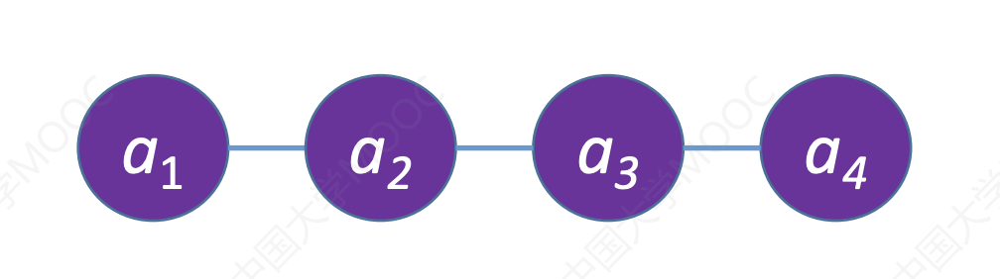
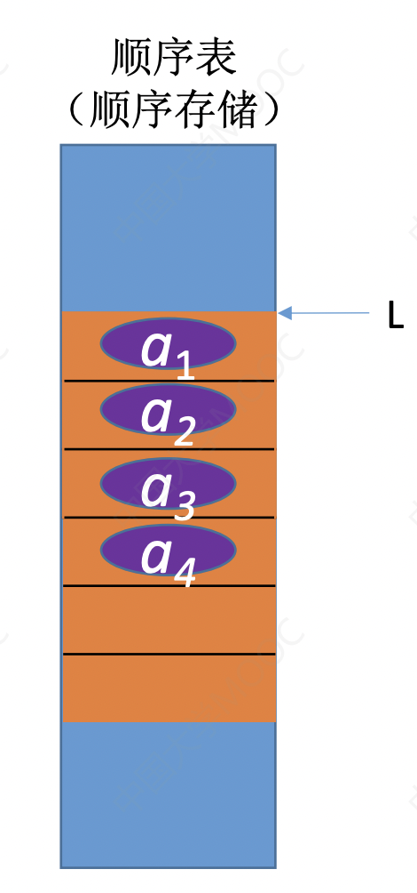
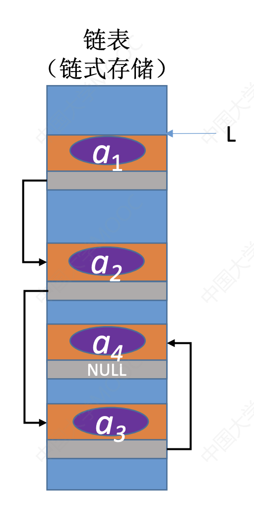

# 顺序表VS链表

### 逻辑结构

顺序表和链表都是线性结构，如图

​																图1-1 线性结构

顺序表和链表的逻辑结构如图

​					图1-2 顺序表和链表的逻辑结构

#### 顺序表的优缺点

优点：支持随机存取，存储密度高

缺点：大片连续空间分配不方便，改变容量不方便

#### 链表的优缺点

优点：离散的小空间分配方便，改变容量方便

缺点：不可随机存取，存储密度低

### 基本操作

#### 初始化操作

**顺序表：**需要预先分配大片连续空间。若分配空间过小，则之后不方便扩展容量；若分配空间过大，则浪费内存资源。

顺序表分配空间方式：

​	静态分配：静态数组---容量不可改变

​	动态分配：动态数组（malloc，free）---容量可以改变，但是需要移动大量元素，时间代价高。

**链表：**只需分配一个头结点（也可以不要头结点，只声明一个头指针），之后方便拓展

#### 销毁操作

**顺序表：**修改Length=0

根据不同分配空间方式：
	静态分配：系统自动回收空间

​	动态分配：需要手动free，`free(L.data)`

**链表：**依次删除各个结点（free）

#### 增加，删除操作

**顺序表：**插入（删除）元素，要将后续元素都后移（前移）

时间复杂度：O(n)，时间开销主要来自于**移动元素**

**链表：**插入（删除）元素，只需修改指针即可

时间复杂度：O(n)，时间开销主要来自于**查找目标元素**

#### 查找查找

**顺序表：**

​	按值查找：O(1)

​	按位查找：O(n)，若表内元素有序，可在O(log2n)时间内找到

**链表：**

​	按值查找：O(n)

​	按位查找：O(n)

### 适用场景

表长难以预估，经常要增加/删除元素---链表

表长可预估，查询（搜索）操作较多---顺序表
