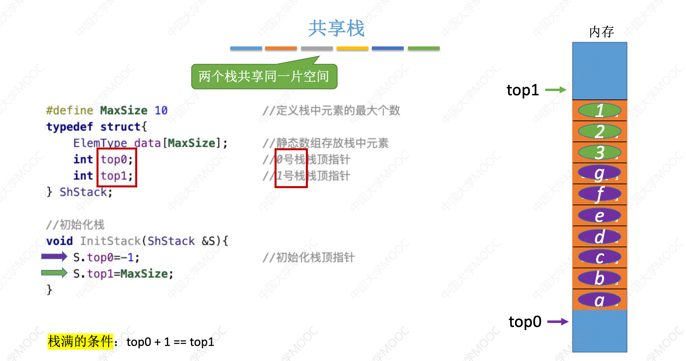

# SequentialStack

缺点：静态数组不可扩容

### 顺序栈的数据结构

```c++
#define MaxSize 10 //定义栈中元素的最大个数
typedef struct{
	ElemType data[MaxSize]; //静态数组存放栈中元素
	int top; //栈顶指针
}SqStack;
```

栈顶指针指向的“下标”

第一种设计方式：栈顶指针指向”栈顶元素“的下标

栈满：`top==MaxSize-1`

栈空：`top=-1`

第二种设计方式：栈顶指针指向“栈顶元素下一位”的下标

栈满：`top==MaxSize`

栈空：`top=0`

### 顺序栈的基本操作(采用的是第一种设计方式)

##### 栈是靠”栈顶指针“决定栈中实际存储的元素个数的。

//初始化栈。构造一个空栈 S，分配内存空间。

#### void InitStack(SqStack &S);

```c++
//初始化栈。构造一个空栈 S，分配内存空间。
void InitStack(SqStack &S){
    S.top=-1;
}
```

//销毁栈。销毁并释放栈 S 所占用的内存空间。

#### bool DestroyStack(SqStack &S);

```

```

//进栈，若栈S未满，则将x加入使之成为新栈顶。

#### bool Push(SqStack &S,ElemType x);

```c++
bool Push(SqStack &S,ElemType x){
    //判断输入数据是否合法
    if(S.top==MaxSize-1) return false;
    //入栈
    S.data[++S.top]=x;
    return true;
}
```

//出栈，若栈S非空，则弹出栈顶元素，并用x返回。

#### bool Pop(SqStack &S,ElemType &x);

```c++
//出栈，若栈S非空，则弹出栈顶元素，并用x返回。
bool Pop(SqStack &S,ElemType &x){
    //判断输入数据是否合法
    if(StackEmpty(S)) return false;
    //出栈
    x=S.data[S.top--];
}
```

//读栈顶元素。若栈 S 非空，则用 x 返回栈顶元素

#### bool GetTop(SqStack S,ElemType &x);

```c++
//读栈顶元素。若栈 S 非空，则用 x 返回栈顶元素
bool GetTop(SqStack S,ElemType &x){
    //判断输入数据是否合法
    if(StackEmpty(S)) return false;
    //获取栈顶元素
    int top_e=S.data[S.top];
    x=top_e;
    return true;
}
```

//判断一个栈 S 是否为空。若S为空，则返回

#### bool StackEmpty(SqStack S);

```c++
//判断一个栈 S 是否为空。若S为空，则返回
bool StackEmpty(SqStack S){
    if(S.top==-1) return true;
    return false;
}
```

## 共享栈

