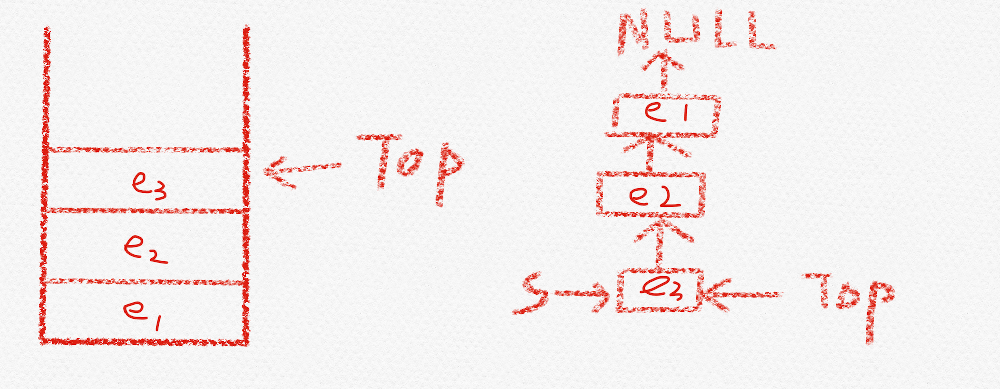

# LinkStack-1

这里采取

1. 不带头结点
2. 头插法存储
3. 栈顶指向栈的栈顶元素


链表存储结构和栈存储结构对比

1. 链表中的头指针就是栈顶指针
2. 链表采用头插法的方式存储结点
3. 这个链表就是把栈倒过来设计



## 链栈的数据结构

`不带头结点`的

```c++
typedef int ElemType;
typedef struct LinkNode{
    ElemType data;
    LinkNode *next;
}*LinkStack;
```

## 链栈的基本操作

//初始化栈。构造一个空栈 S，分配内存空间。

### void InitStack(LinkStack &S);

```c++
//初始化栈。构造一个空栈 S，分配内存空间。
void InitStack(LinkStack &S){
    S=NULL;
}
```

//判断一个栈 S 是否为空。若S为空，则返回

### bool StackEmpty(LinkStack S);

```c++
//判断一个栈 S 是否为空。若S为空，则返回
bool StackEmpty(LinkStack S){
    if(S==NULL) return true;
    return false;
}
```

//读栈顶元素。若栈 S 非空，则用 x 返回栈顶元素

### bool GetTop(LinkStack S,ElemType &x);

```c++
//读栈顶元素。若栈 S 非空，则用 x 返回栈顶元素
bool GetTop(LinkStack S,ElemType &x){
    //判断输入数据是否合法
    if(S==NULL) return false;
    //获取栈顶元素
    x=S->data;
    return true;
}
```

//进栈，若栈S未满，则将x加入使之成为新栈顶。

### bool Push(LinkStack &S,ElemType x);

```c++
//进栈，若栈S未满，则将x加入使之成为新栈顶。
bool Push(LinkStack &S,ElemType x){
    //判断输入数据是否合法

    //创建一个准备好的结点p
    LinkNode *p=(LinkNode*) malloc(sizeof (LinkNode));
    if(p==NULL) return false;
    p->data=x;
    p->next=NULL;
    //入栈操作,将准备好的结点以头插法的方式插入到栈中
    //判断栈是否空
    if(!StackEmpty(S)){
        p->next=S;
    }
    S=p;
    return true;
}
```

//出栈，若栈S非空，则弹出栈顶元素，并用x返回。

### bool Pop(LinkStack &S,ElemType &x);

```c++
//出栈，若栈S非空，则弹出栈顶元素，并用x返回。
bool Pop(LinkStack &S,ElemType &x){
    //判断输入条件是否合法
    if(StackEmpty(S)) return false;
    //出栈操作，获取栈顶结点
    LinkNode *q=S;
    x=q->data;
    S=q->next;
    free(q);
}
```

//销毁栈。销毁并释放栈 S 所占用的内存空间。

### bool DestroyStack(LinkStack &S);

```c++
//销毁栈。销毁并释放栈 S 所占用的内存空间。
bool DestroyStack(LinkStack &S){
    //遍历S
    while (S!=NULL){
        LinkNode *q=S;
        S=S->next;
        free(q);
    }
}
```

