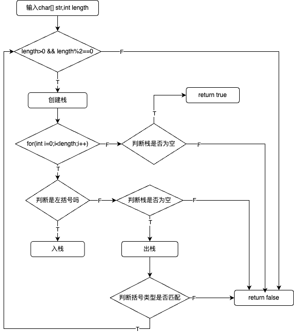

# Stack-ParenthesisMatching（括号匹配）

#### 问题描述：

给一个装了若干个括号的字符数组，判断这个数组中的括号的顺序是否符合括号的语法。

#### 问题分许：

`( { ( ) } ( ) )`  

逐一扫描这个字符数组

若为左括号：将左括号暂存

若为右括号：取出暂存的左括号的最后一个，判断是否匹配。

**综上：**使用**栈**，后进先出

#### 异常情况：

`{ ( {  ) }` ：

1. 数组中的个数不为偶数
2. `{` 和 `)` 括号类型不匹配

`{ ( ( ) ( )`：

1. 数组扫描完毕后，栈中还有元素存在

`{ ( ) ( ( ) ) ( ) } ) )`

1. 数组扫描到了右括号，但是栈为空

### 数据流程图



### 需要的基本操作（采用顺序栈，栈顶指向最后一个元素）

//匹配括号

#### bool Match(char str[],int length);

```c++
bool Match(char str[],int length){
    //判断输入数据是否合法
    if(length < 0 || length % 2 != 0) return false;
    //创建栈
    SqStack S;
    InitStack(S);
    char left;
    //扫描数组
    for(int i=0;i<length;i++){
        //判断是否为左括号
        if(str[i] == '(' || str[i] == '{' || str[i] == '['){
            //入栈
            Push(S,str[i]);
        } else if(str[i] == ')' || str[i] == '}' || str[i] == ']'){//为右括号时
            //判断栈是否为空
            if(EmptyStack(S)) return false;
            //出栈
            Pop(S,left);
            //判断括号类型是否符合
            if(!Equal(str[i],left)) return false;
        } 
    }
    //扫描完成后判断栈是否为空，即判断有没有多余的左括号
    if(EmptyStack(S)) return true;
    return false;
}
```

//判断括号类型

#### bool Equal(char right,char left);

```c++
bool Equal(char right,char left){
    if(right == '}') return left == '{';
    if(right == ']') return left == '[';
    if(right == ')') return left == '(';
    return false;
}
```

//栈的初始化

#### void InitStack(SqStack &S);

```c++
void InitStack(SqStack &S){
    for(int i=0;i<MaxSize;i++){
        S.data[i]=0;
    }
    S.top=-1;
}
```

//判断栈是否为空

#### bool EmptyStack(SqStack S);

```c++
bool EmptyStack(SqStack S){
    if(S.top==-1) return true;
    return false;
}
```

//入栈

#### bool Push(SqStack &S,ElemType e);

```c++
bool Push(SqStack &S,ElemType e){
    //判断输入数据是否合法
    if(S.data==NULL) return false;
    if(S.top==MaxSize-1) return false;
    //入栈
    S.data[++S.top]=e;
    return true;
}
```

//出栈

#### bool Pop(SqStack &S,ElemType &e);

```c++
bool Pop(SqStack &S,ElemType &e){
    //判断输入是否合法
    if(S.data==NULL) return false;
    if(EmptyStack(S)) return false;
    //出栈
    e=S.data[S.top--];
    return true;
}
```

#### 