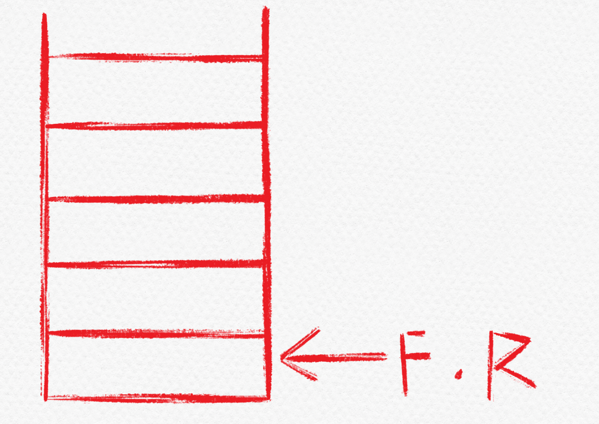
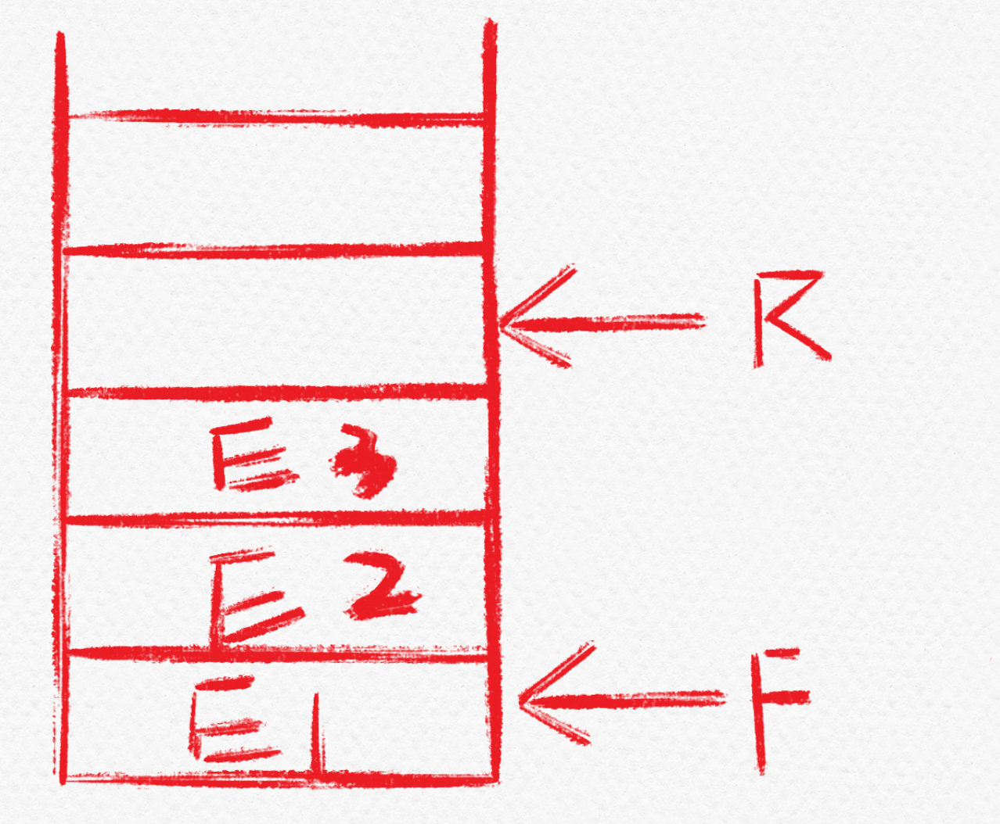
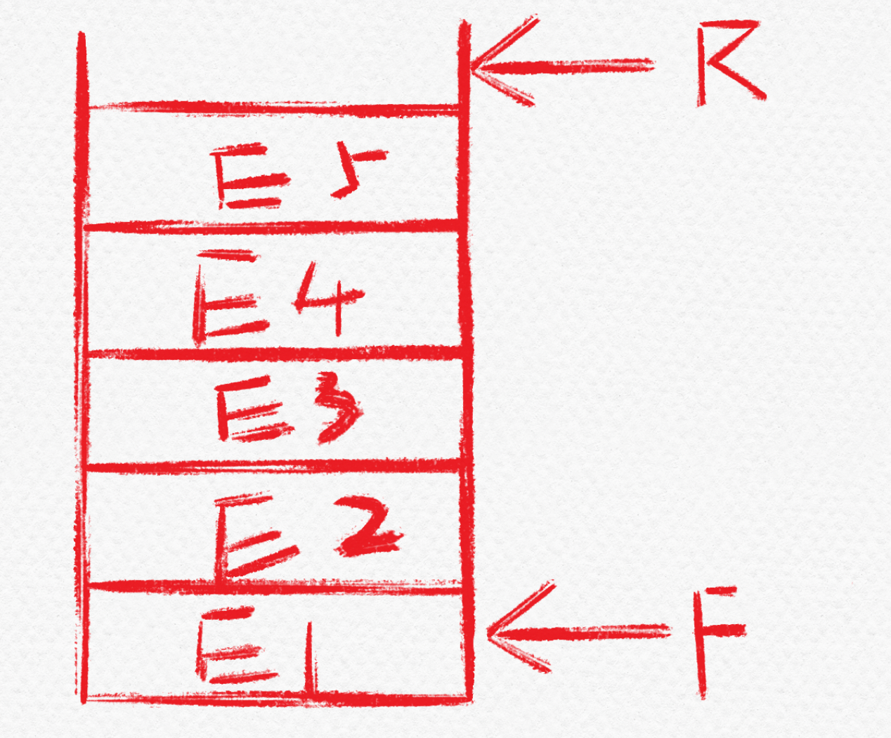
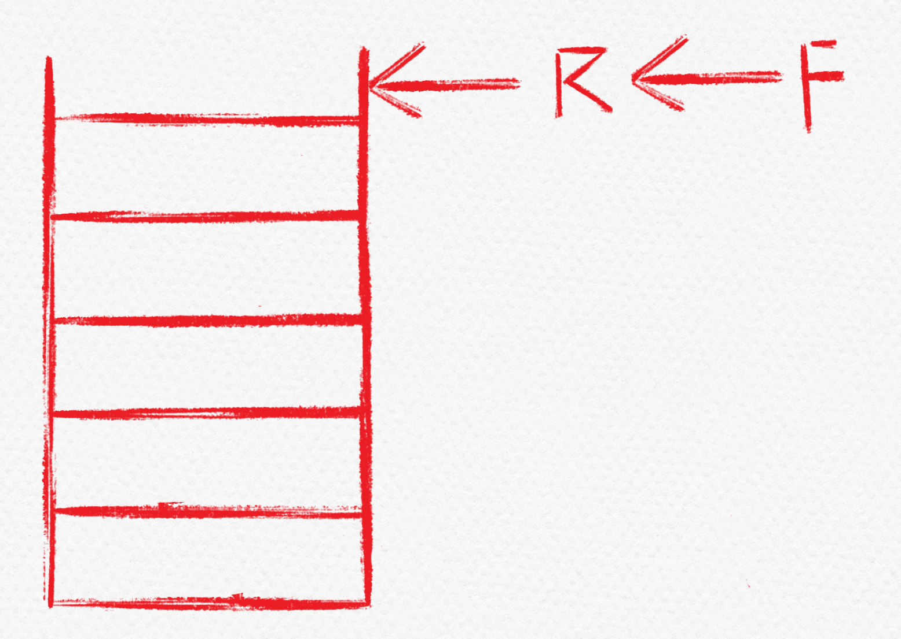

# SequenceQueue-循环队列

队头指向队头元素

队尾指向队尾元素的后一位。

当队列为空时，如图



​										  						图1-1 空表图

当队列中有三个元素时如图



​										  					图1-2 队列元素图

当队列满时如图



​										  					图1-3 队列满图

当队列满后，把元素全部删除后，如图



​										  					图1-4 队列满后删除图

如图可以看出，数组会出现`上溢出`

1. 3. #### 解决`上溢出`的方法

      采用循环队列

      循环列表的指针的移动方式
      
      `Q.front=(Q.front+1)%MaxSize`
      
      `Q.rear=(Q.rear+1)%MaxSize`
      
      1. ##### 牺牲一个存储空间（以下代码采用的方式）
      
         队列空时：`Q.front==Q.rear`
      
         队列满时：`(Q.rear+1)%MaxSize=Q.front`
      
         队列元素个数：`(rear+MaxSize-front)%MaxSize`
      
      2. ##### 不牺牲空间，添加一个变量size，记录队列中元素的个数
      
         队列空时：`size==0`
      
         队列满时：`size==MaxSize`
      
      3. ##### 不牺牲空间，添加一个变量tag，记录最近操作的类型（入队：1    出队：0）
      
         队列空时：`Q.front==Q.rear && tag=0`
      
         队列满时：`Q.front==Q.rear && tag=1`

### 顺序队列的数据结构

```c++
#define MaxSize 10
typedef int E	lemType;
typedef struct{
	ElemType data[MaxSize];
	int front;
	int rear;
};
```

### 顺序队列的基本操作

//初始化队列，构建一个空的队列

#### void InitQueue(SqQueue &Q);

```c++
void InitQueue(SqQueue &Q){
    Q.front=Q.rear=0;
}
```

//判队列空，若队列Q为空返回true，否则返回false

#### bool QueueEmpty(SqQueue Q);

```c++
bool QueueEmpty(SqQueue Q){
    if(Q.rear==Q.front) return true;
    return false;
}
```

//入队，若队列Q未满，将x加入，使之成为新的队尾

#### bool EnQueue(SqQueue &Q,ElemType x);

```c++
bool EnQueue(SqQueue &Q,ElemType x){
    //判断输入条件是否合法
    if((Q.rear+1)%MaxSize==Q.front) return false;
    //入队
    Q.rear=(Q.rear+1)%MaxSize;
    Q.data[Q.rear]=x;
    return true;
}
```

//出队，若队列Q未空，删除队头元素，并用x返回

#### bool DeQueue(SqQueue &Q,ElemType &x);

```c++
bool DeQueue(SqQueue &Q,ElemType &x){
    //判断输入条件是否合法
    if(QueueEmpty(Q)) return false;
    //出队
    Q.front=(Q.front+1)%MaxSize;
    x=Q.data[Q.front];
    return true;
}
```

//读队头元素，若队列Q非空，则将队头元素赋值给x

#### bool GetHead(SqQueue Q,ElemType &x);

```c++
bool GetHead(SqQueue Q,ElemType &x){
    //判断输入条件是否合法
    if(QueueEmpty(Q)) return false;
    //读取队头元素
    x=Q.data[Q.front];
}
```

### 其他

#### 要求front指向队列的队头元素，rear指向队列的队尾元素

初始化队列：`Q.front=0;` `Q.rear=-1`

入队：`Q.data[Q.rear]=e;` `Q.rear=(Q.rear+1)%MaxSize;`

出队：`e=Q.data[Q.front];` `Q.front=(Q.front+1)%MaxSize;`

1. ##### 牺牲一个存储空间（以下代码采用的方式）

   队列空时：`Q.front==Q.rear+1`

   队列满时：`(Q.rear+2)%MaxSize=Q.front`

2. ##### 不牺牲空间，添加一个变量size，记录队列中元素的个数

   队列空时：`size==0`

   队列满时：`size==MaxSize`

3. ##### 不牺牲空间，添加一个变量tag，记录最近操作的类型（入队：1    出队：0）

   队列空时：`Q.front==Q.rear+1 && tag=0`

   队列满时：`Q.front==Q.rear+1 && tag=1`